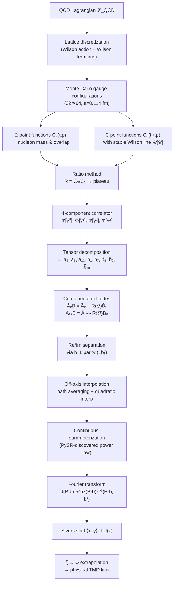

# Deep Wiki — Physics Concepts & Derivation Chain

> **Last updated**: 2026-08-23

---

## 1. Core Physical Observable

**The Sivers Shift** $\langle k_y \rangle_{TU}(x, b_T^2, \hat{\zeta})$: the average transverse momentum of unpolarized quarks in a transversely polarized nucleon, as a continuous function of the longitudinal momentum fraction $x$.

```
 Sivers shift = (Sivers TMD moment) / (Unpolarized TMD)
              = m_N × FT[Ã₁₂B^Re] / FT[Ã₂B^Re + i·Ã₂B^Im]
```

---

## 2. Derivation Chain (End-to-End)

The logical chain from the QCD Lagrangian to the final $x$-dependent Sivers shift:



---

## 3. Key Concepts — Detailed

### 3.1 TMD Correlator and Soft Factor

The master formula:
$$\Phi^{[\Gamma]}(x, \vec{k}_T; P, S) = \int \frac{d^2\vec{b}_T}{(2\pi)^2} \int \frac{d(b \cdot P)}{2\pi P^+} \, e^{ix(b \cdot P) - i\vec{b}_T \cdot \vec{k}_T} \frac{\widetilde{\Phi}^{[\Gamma]}_{\text{unsub}}(b, P, S)}{\widetilde{S}(b^2)}$$

The soft factor $\widetilde{S}$ regulates rapidity divergences. It **cancels in the Sivers shift ratio**, so it never needs to be explicitly computed.

### 3.2 Staple-Shaped Wilson Line

$$\mathcal{U}[\mathcal{C}_b^{(\eta v)}] = \mathcal{U}[0 \to \eta v \to \eta v + b \to b]$$

- $v$: space-like direction vector (must satisfy $v^2 < 0$ for Euclidean lattice)
- $\eta$: staple extent parameter
- Physical limit: $\eta \to \infty$ (area-law decay $\sim e^{-f\eta}$)
- Process dependence: sign of $\eta v \cdot P$ distinguishes SIDIS ($+\eta$) from DY ($-\eta$)

### 3.3 Collins-Soper Parameter

$$\hat{\zeta} = \frac{v \cdot P}{m_N \sqrt{|v^2|}} = \sinh(y_P - y_v)$$

| $P_1$ (units of $2\pi/(La)$) | $\hat{\zeta}$ | $v_1 / v_3$ |
|:----:|:----:|:----:|
| $-1$ | $0.0908$ | $0.301$ |
| $-2$ | $0.2944$ | $0.531$ |
| $-3$ | $0.5397$ | $0.689$ |
| $-4$ | $0.7858$ | $0.786$ |

Physical TMD limit: $\hat{\zeta} \to \infty$.

### 3.4 Invariant Amplitude Decomposition

The $\gamma^+$-projected correlator decomposes into:
$$\frac{1}{2P^+} \widetilde{\Phi}^{[\gamma^+]}_{\text{unsub}} = \widetilde{A}_{2B} + i m_N \epsilon_{ij} b_i S_j \, \widetilde{A}_{12B}$$

where:
- $\widetilde{A}_{2B} \equiv \widetilde{A}_2 + R(\hat{\zeta}^2) \widetilde{B}_1$ → **unpolarized** amplitude
- $\widetilde{A}_{12B} \equiv \widetilde{A}_{12} - R(\hat{\zeta}^2) \widetilde{B}_8$ → **Sivers** amplitude
- $R(\hat{\zeta}^2) = 1 - \sqrt{1 + \hat{\zeta}^{-2}}$

### 3.5 Hermitian Conjugation & Parity

From $[\widetilde{\Phi}(b)]^* = \widetilde{\Phi}(-b)$:

| Component | Parity in $b \cdot P$ | Fourier partner |
|-----------|----------------------|-----------------|
| $\widetilde{A}_{iB}^{\text{Re}}$ | **Even** | $\cos(x \cdot P \cdot b)$ |
| $\widetilde{A}_{iB}^{\text{Im}}$ | **Odd** | $\sin(x \cdot P \cdot b)$ |

This is exploited by evaluating at $+b_1$ and $-b_1$ and taking symmetric/antisymmetric combinations.

### 3.6 The Sivers Shift (Final Formula)

After parity filtering and $e^{-f\eta}$ cancellation:
$$\langle k_y \rangle_{TU}(x) = \frac{m_N \int d(P \cdot b) \, \cos(x \cdot P \cdot b) \cdot \widetilde{A}_{12B}^{\text{Re}}}{\int d(P \cdot b) \left[\cos(x \cdot P \cdot b) \cdot \widetilde{A}_{2B}^{\text{Re}} - \sin(x \cdot P \cdot b) \cdot \widetilde{A}_{2B}^{\text{Im}}\right]}$$

### 3.7 The Gaussian Failure

A simple Gaussian model $\gamma e^{-\alpha b_L^2 - \beta b_T^2}$ transforms to:
$$\gamma \exp\left[-\frac{(\alpha - \beta)}{P_L^2}(P \cdot b)^2 - \beta b^2\right]$$

Fourier integrability requires $\alpha > \beta$. Lattice data consistently yields $\alpha < \beta$ (faster transverse decay), making the Gaussian **unphysical**.

$\chi^2/\text{dof} \approx 230$ for $\widetilde{A}_{2B}^{\text{Re}}$.

### 3.8 The Power-Law Resolution (PySR Discovery)

PySR discovers:
$$\widetilde{A}_{2B}^{\text{Re}} = \frac{a \, e^{-f\eta}}{(1 + c \, b_L^2 + d \, b_T^2)^j}$$

- Power-law tail $(1 + b^2)^{-j}$ with $j > 1/2$ is **always Fourier-integrable**
- No sign constraint needed (unlike the Gaussian $\alpha > \beta$)
- Independently verified by the log-linear straight-line diagnostic

### 3.9 The $\hat{\zeta} \to \infty$ Extrapolation

The fit parameters at each $P_L$ (and corresponding $\hat{\zeta}$) are extrapolated linearly in $1/\hat{\zeta}^2$ using $P_L \in \{-2, -3, -4\}$. $P_L = -1$ is excluded due to its extreme distance from the light-cone limit.

---

## 4. Assumptions and Caveats

| Assumption | Impact | Status |
|-----------|--------|--------|
| **Single lattice spacing** ($a = 0.114$ fm) | No continuum extrapolation | Open — systematic uncertainty |
| **Unphysical pion mass** ($m_\pi \approx 518$ MeV) | Not at physical quark masses | Open — systematic uncertainty |
| **$|\vec{b}| \geq 3a$ cut** | Excludes UV artifacts but discards short-distance data | Justified by opposite-curvature diagnostic |
| **$\eta \in [6, 10]$** | Assumes $\eta \to \infty$ plateau reached | Validated by $\eta$-stability tests |
| **Shared $e^{-f\eta}$ across amplitudes** | Physical (area law); enables ratio cancellation | Confirmed by independent sequential fits |
| **Power-law spatial profile** | Replaces Gaussian; PySR-discovered | Validated by log-linear test + $\chi^2$ |
| **Jackknife covariance** | Finite-sample estimator | Standard methodology; 1000 configs |
| **$\hat{\zeta}$ extrapolation** linear in $1/\hat{\zeta}^2$ | Functional form of approach to light cone | Open — could be non-linear |

---

## 5. Key References (from BibTeXList.bib)

- **Sivers 1989** (`Sivers:1989cc`): Original Sivers function proposal
- **Collins 2011** (`CollinsBook2011`): TMD factorization and soft factor
- **Aybat & Rogers 2011** (`Aybat:2011zv`): Evolution equations
- **Musch et al. 2011** (`Musch:2011er`): Lattice TMD methodology — primary predecessor
- **Boer et al. 2011** (`Boer:2011xd`): Bessel-weighted TMDs
- **Goeke et al. 2005** (`Goeke:2005hb`): Amplitude decomposition
- **Cranmer 2023** (`Cranmer2023pysr`): PySR symbolic regression
